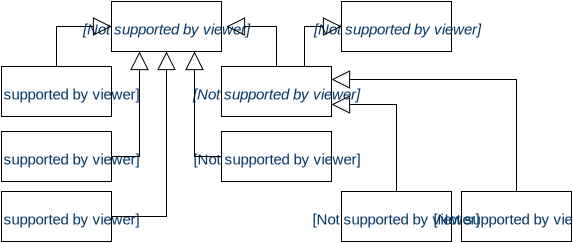
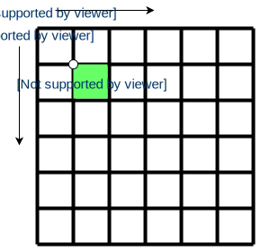

# Display System Architecture

**Mono display system is makes it easy and fast to create graphical user interfaces (GUIs). You can take advantage of the many high-level classes, that display controls or text in the screen.**

#### Who should read this?

In this article we will take an in-depth look at Mono's display system. You should read this if you wish to create your own *User Interface* elements or if you experience issues related to displaying graphics. Also, if you simply would like to know more about how the software works under the hood. I presume you already are familiar with other GUI system programming, like iOS or Qt.

## Overview

The Mono framework implements a display stack that closely assembles the first computer GUI systems, like the first Mac OS or Atari TOS. It is a single display buffer that your application paints in. The buffer is placed in the display chip, and is therefore not a part of the MCU systems internal RAM. This means writing (and reading) to the display buffer is expensive operations, and should only be done in an efficient way.

To paint on the display the view stack has 3 distinct layers:

 1. **The Display controller**: An object that communicates with the hardware display chip, and can read and write to the display buffer. The display controller objects can write pixels in an file I/O like manner. It does not have any notion of text glyphs or graphical shapes.
 2. **The Display Painter**: The painter object can translate geometrical shapes into pixels. It utilizes the *Display Controller* as a pixels drawing target. The painter can also draw individual text glyphs, and works with colors too.
 3. **The Views**: A view is an abstract class that represents a User Interface element, like a button. It uses the *Display Painter* to composite a complete element from a series of shape painting routines. Some views also works with touch input.

We shall only visit the last layer (Views) in this tutorial.

## The Views

All UI element classes inherit from the `View` class. The view class defines the properties and behaviors shared by  all UI elements. The mono framework comes with a set of predefined UI views that comprises different UI elements. They all in inherit from the `View` class, as seen on the figure below:



If you need learn about the specific UI classes can their usage, please see the reference documentation or the **Drawing UI Elements** tutorial.

As all classes inherit from the parent `View` class, they all define these central properties:

 * **The View Rect**: A rectangle that defines the boundaries of the view. This is the views width and height, but also its X,Y position on the display.
 * **Standard Colors**: All views share a palette of standard/default colors for borders, text, backgrounds and highlights. Changing one of these will affect all view subclasses.
 * **Dirty state**: Views can be *dirty*, meaning that they need to be repainted on the screen. You might change the content of a `TextLabelView`, and the view will need to be repainted - therefore it is *dirty*. When the view has been repainted, the dirty state is cleared.
 * **Repainting**: All `View` subclasses must define the protected method `repaint()`. Dirty views are scheduled for repaint by the display system, meaning that the `repaint()` method is automatically called to actually draw the view. If you create your own custom views, all your shape painting *must* happen inside the `repaint()` routine.
 * **Visibility state**: Views can be visible or invisible. When first created, a view is always invisible. This means it will not be scheduled for repaints at all. To make a view appear on the display, you must first call the `show()` method. This will set its state to *visible*.

Since all views share a single global display buffer, you can (by mistake or on purpose) position one view overlapping another. The display system does not have any notion of a Z-axis. To the top-most view will be the one that gets its `repaint()` method called last. The display system keeps dirty views in a queue, so they are repainted in a FIFO style manner.

When you create your own views, it is your responsibility to respect the views boundaries. Say, a view with the dimensions 100x100, must not draw any shapes outside its 100x100 rectangle. Shape drawing inside the `repaint()` method is not automatically clipped to the views bounding rectangle. It is perfectly possible to create a view, that completely ignores its bounding rectangle.

> *In contrast to many modern GUI systems, mono views cannot contain nested views. However, this does not mean a view cannot contain another. It just has to manually manage it.*

## Display Coordinate System

All views and painted shapes exists in the painter's coordinate system. This coordinate system is cartesian with origin in the top left corner. The positive Y direction is downward, while positive X is left to right. The coordinates are in pixels, meaning they are integers.



An example of the used coordinate system is seen in the figure above. Notice how the pixel's coordinate references the upper left corner of the pixel area - not the center.

Because views cannot be nested, we use only one global coordinate system. It is called the absolute coordinate system, and all shapes and views are painted relative to that. This means that if you position views with the offset coordinate \\\((20,20)\\\), you must offset all shape painting with \\\((20,20)\\\).

### Rotations

Mono includes an accelerometer, that enables you to detect orientation changes. You can create an application that layout its content differently in landscape and portrait modes.

Unfortunately, at this time, I have yet to implement an automatic coordinate system rotation, that uses the accelerometer. I plan to augment the `Display Painter` class with the ability to rotate the coordinate system, to account for mono physical orientation. This will mean the coordinate system's origin will always be the upper left corner relative to gravity, and independent on the physical orientation.

## Pixel Blitting

The *display painter* class takes commands like `drawRect(x,y,w,h)`, that paints an outlined rectangle on the display. It handles conversion from geometric shape parameters, into a series of pixels. These pixels are written to the display through the *Display Controller* object. 

The pixel color is determined by the state of the painter. The painter has foreground and background color, that can be set before the calls to shape drawing routines. Shapes are painted using the foreground color by default, but you can explicitly tell the routines to use the background color instead.

The text glyphs drawing routine uses both the foreground and background colors, to draw the text glyphs against the background color.

### Bitmaps & Colors

The display painter cannot take pixels as input. If you need to draw raw pixels or bitmaps from a file or memory, you need to interface the Display Controller directly. The display controller has a cursor that points to a location on the display. When you write a pixel, the cursor increments. The incrementation is from left to right, and downward. (Normal western reading direction.)

Basically you need only to use 2 methods: `write(color)` and `setCursor(x,y)`. You can see how if you take a look at the source code for the class `ImageView`. It blit pixels using the *display controller*, from within its `repaint()` method.

If you plan to use bitmaps, keep in mind that Mono's memory is very limited. Therefore I will encourage you *not* to use large in-memory pixel buffers. Instead use the SD Card file I/O, as done by the `ImageView` class.

When you write raw pixels, you must use the correct pixel color format. For mono this is **16 bit, 5-6-5 RGB colors**. Note that Mono's CPU architecture is little endian, and the display uses big endian. If you define a color like this: 

```c
uint16_t color = 0x07E0; // I think this might be a green color?
```

The color will be interpreted by the display as: `0xE007`. For convenience you should use the `Color` class, that has a constructor that takes RGB components as separate values.

## V-Sync and refreshes

The display hardware periodically refreshes the LCD. If you change the display buffer during a refresh, you will see weird artifacts. Especially animations are prone to such artifacts.

To counter this mono uses *tearing effect* interrupts. This interrupt works like the v-sync signal on RGB interfaced displays. It occurs the moment after a display refresh. After the interrupt there is a time window, where the display buffer can be changed, before the display refreshes again.

Modern systems uses a technique called double buffering, where two separate display buffers exists. This means that one can be modified while the other is shown. When all changes has been written, the buffer that is displayed are changed to the other one. This technique makes it possible is to (slowly) write a lot of changes to the display, and have them appear instantly.

Unfortunately we do not have this facility in Mono. There is only one display buffer. This means all drawing must have finished, by the time the display is refreshed again. To not exceed the time window between display refreshes, all painting routines must be very efficient and optimized. If you create your own view subclasses, keep in mind that your drawing must be highly efficient. It is best only to paint changes, and not the entire view again.

The display system automatically handle this *tearing effect* timing, and skips repainting, should the CPU be too busy at the moment of the interrupt.