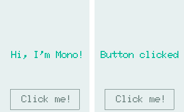

# Adding a Button to the Screen

***In this quick tutorial we shall see how to add a set of push buttons to the screen.***

The SDK comes this standard classes for screen drawing and listening for touch input. One of these classes are [`ButtonView`](/en/latest/reference/mono_ui_ButtonView.html). *ButtonView* display a simple push button and accepts touch input.

## Reacting to clicks

Let us go create a new Mono project, fire up your terminal and:

```
$ monomake project buttonExample
```

To create a button on the screen we first add a `ButtonView` object to `AppController`. Insert this into *app_controller.h*:

```cpp
class AppController : public mono::IApplication {
    
    // This is the text label object that will displayed
    TextLabelView helloLabel;

    // We add this: our button object
    ButtonView btn;
    
public:

    // The default constructor
    AppController();

    // We also add this callback function for button clicks
    void buttonClick();
```


We added a member object for the button itself and a member method for its callback. This callback is a function that is called, then the button is clicked.

Now, in the implementation file (app_controller.cpp), we add the button the contructor initializer list:

```cpp
AppController::AppController() :

    // Call the TextLabel's constructor, with a Rect and a static text
    helloLabel(Rect(0,100,176,20), "Hi, I'm Mono!"),

    // Here we initialize the button
    btn(Rect(20, 175, 136, 40), "Click me!")
{
```

The button's constructor takes 2 arguments: *position and dimension* rectangle and its *text label*. The first argument is a [`Rect`](/en/latest/reference/mono_geo_Rect.html) object, it defines the rectangle where the Button lives. This means it will draw itself in the rectangle and listen for touch input in this rectangle:


The second argument is the text label that is displayed inside the button. In this example it is just the text *Click me!*

To trigger a response when we click the button, we need to implement the function body for the `buttonClick` method. In *app_controller.cpp* add this method:

```cpp
void AppController::buttonClick()
{
    helloLabel.setText("Button clicked!");
}
```

This method changes the content of the project templates existing `helloLabel` to a new text. Lastly, we connect the button click handler to call our function. From inside the `monoWakeFromReset` method, we append:

```cpp
// tell the label to show itself on the screen
helloLabel.show();

// set the callback for the button click handler
btn.setClickCallback<AppController>(this, &AppController::buttonClick);
// set the button to be shown
btn.show();
```

That's it! Run `make install` and see the example run on Mono:

